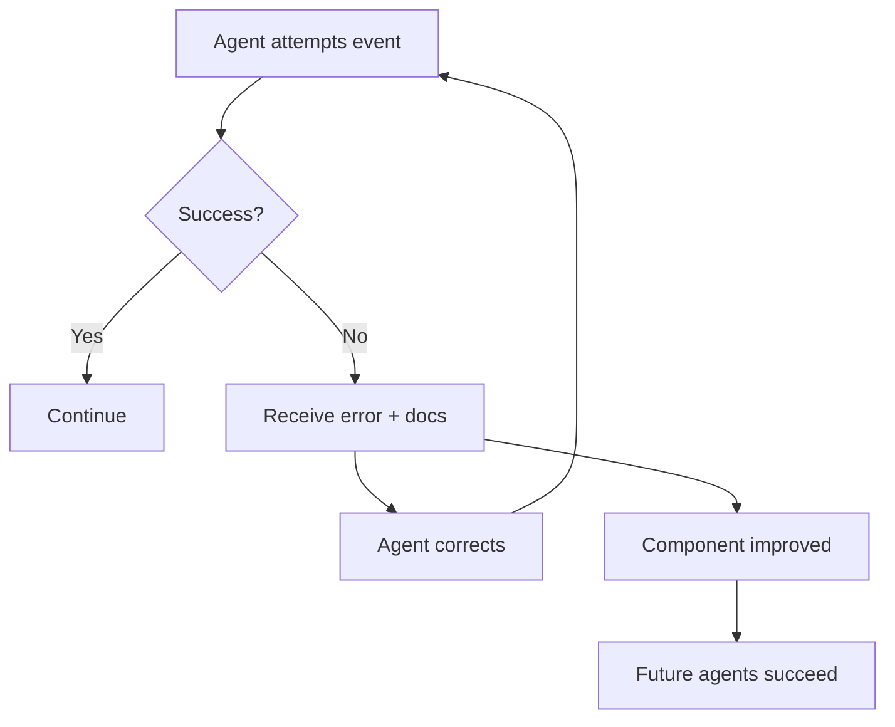

# Agent Improvement Roadmap: Methodical Bottom-Up Architecture

**Core Methodology:** Build → Test → Validate → Ascend  
**Current Layer:** Foundation (Event Emission & Routing)  
**Last Updated:** 2025-08-06  
**Key Principle:** Never advance to the next layer until the current layer is proven

## The Bottom-Up Imperative

### Why Bottom-Up Matters
Building from the bottom up ensures:
- **Each layer is solid** before depending on it
- **Failures are caught early** at the simplest level
- **Complex behaviors emerge** from simple, proven primitives
- **Debugging is tractable** - problems isolated to current layer
- **Confidence compounds** - each validated layer increases system trust

### Our Methodology
```
Layer N:
  1. Build minimal implementation
  2. Test in isolation
  3. Validate behavior matches expectations
  4. Document what works and what doesn't
  5. Only then proceed to Layer N+1
```

## Layer Architecture (Bottom to Top)

### Layer 0: Primitive Capabilities ✅ VALIDATED
**Status:** Complete and proven

**Components:**
- Event emission (`evaluation:run`, `optimization:async`)
- State management (`state:entity:*`)
- Component access (`composition:get_component`)
- Basic routing (`routing:add_rule`)

**Validation Tests:**
```bash
# Test each primitive in isolation
ksi send evaluation:run --component "hello_agent" --test_suite "basic"
ksi send state:entity:create --type "test" --properties '{"key": "value"}'
ksi send routing:add_rule --rule_id "test" --source "a" --target "b"
```

**Result:** All primitives work independently

### Layer 1: Agent Event Emission ✅ VALIDATED (with caveats)
**Status:** Core emission works, error handling needed

**What We Built:**
Agents that can emit KSI events using tool use patterns

**What Works:**
- ✅ Agents spawn successfully
- ✅ Agents emit events when prompted
- ✅ Events are extracted from responses
- ✅ Event appears in monitor

**Critical Gap: Error Feedback Loop**
When extracted events fail (wrong parameters, missing fields):
- ❌ Agent doesn't receive error feedback
- ❌ Agent can't correct and retry
- ❌ Errors don't bubble to parent agents
- ❌ Hook doesn't show error details

**Solution Architecture:**
```yaml
Error Flow:
  1. Agent emits ksi_tool_use → Event extracted
  2. Event processing fails → Error generated
  3. Error sent back to agent via completion:error
  4. Agent receives error, can retry with correction
  5. Error bubbles to parent agent (if spawned by one)
  6. Hook shows full error details with agent_id

Component Quality:
  - Components must include CORRECT event usage
  - Template substitution for documentation:
    {{ksi_help agent:spawn}}
    {{ksi_disc namespace agent detail}}
  - Automatic inclusion based on capabilities
  - Single source of truth from handlers
```

### Layer 1.5: Error Feedback & Self-Documentation 🔴 CRITICAL
**Status:** Not implemented - BLOCKS PROGRESS

**What We Need:**
A bidirectional error flow and self-documenting components

**Implementation Requirements:**

#### Error Feedback Loop
```python
# When event extraction fails
if event_validation_fails:
    error_msg = format_error_with_context(error, expected_params)
    # Send error back to originating agent
    emit("completion:error", {
        "agent_id": extracted_event.agent_id,
        "error": error_msg,
        "failed_event": extracted_event,
        "correction_hint": get_param_documentation(event_name)
    })
    # Bubble to parent if exists
    if parent_agent:
        emit("agent:child_error", {
            "parent_id": parent_agent,
            "child_id": agent_id,
            "error": error_msg
        })
```

#### Self-Documenting Components
```yaml
# Component with template substitution
---
component_type: agent
name: spawner_agent
---
You can spawn agents using:

{{ksi_help agent:spawn}}

Available profiles:
{{ksi_disc namespace composition filter="profile"}}

Your capabilities allow these events:
{{ksi_events_for_capabilities agent_spawn}}
```

#### Hook Error Display (ALL modes)
```python
# Enhanced hook error handling
def format_error_output(error_event):
    return f"⚠️ ERROR from {error_event['agent_id']}: {error_event['error']}"
```

**Benefits:**
- Agents learn from mistakes
- Components stay current with API
- Debugging becomes trivial
- No silent failures

### Layer 2: Agent Routing Control ⏳ PENDING
**Status:** Not yet tested

**What We're Building:**
Agents that create routing rules to orchestrate workflows

**Bottom-Up Test Sequence:**
```bash
# Step 1: Test routing rule creation
cat << 'EOF' > /tmp/test_router.md
---
component_type: agent
---
Create this routing rule:
{
  "type": "ksi_tool_use",
  "name": "routing:add_rule",
  "input": {
    "rule_id": "test_route",
    "source_pattern": "evaluation:result",
    "target": "optimization:async"
  }
}
EOF

# Step 2: Test rule takes effect
# Create evaluation → trigger optimization via rule

# Step 3: Validate chain executed
```

**Validation Criteria:**
- ⏳ Agent can create routing rules
- ⏳ Rules actually route events
- ⏳ Complex routing patterns work
- ⏳ Rules can be modified/deleted

### Layer 3: Agent Spawning Agents ⏳ PENDING
**Status:** Not yet tested

**What We're Building:**
Agents that spawn specialized agents for subtasks

**Bottom-Up Test Sequence:**
```bash
# Step 1: Parent spawns child
# Step 2: Child performs task
# Step 3: Parent receives child results
# Step 4: Validate full cycle
```

**Validation Criteria:**
- ⏳ Agent can spawn another agent
- ⏳ Child agent receives correct prompt
- ⏳ Results flow back to parent
- ⏳ Multiple children can be coordinated

### Layer 4: Event Chain Orchestration ⏳ PENDING
**Status:** Not yet tested

**What We're Building:**
Complete evaluation → optimization → validation chains

**Bottom-Up Test Sequence:**
```bash
# Step 1: Test evaluation triggers optimization
# Step 2: Test optimization triggers validation  
# Step 3: Test validation triggers decision
# Step 4: Test full chain end-to-end
```

**Validation Criteria:**
- ⏳ Each link in chain works
- ⏳ Data flows through chain
- ⏳ Errors propagate correctly
- ⏳ Chain can be monitored

### Layer 5: Comparative Analysis ⏳ PENDING
**Status:** Not yet tested

**What We're Building:**
Intelligent comparison instead of fixed metrics

**Bottom-Up Test Sequence:**
```bash
# Step 1: Test baseline establishment
# Step 2: Test optimization with comparative goals
# Step 3: Test judge comparison
# Step 4: Test deployment decision
```

**Validation Criteria:**
- ⏳ Baselines are properly stored
- ⏳ Comparisons are intelligent
- ⏳ Trade-offs are evaluated
- ⏳ Decisions are justified

### Layer 6: Self-Improvement Orchestrator ⏳ PENDING
**Status:** Not yet deployed

**What We're Building:**
The orchestrator that coordinates improvement cycles

**Bottom-Up Test Sequence:**
```bash
# Step 1: Test with simplest component (hello_agent)
# Step 2: Test with complex component
# Step 3: Test with multiple components
# Step 4: Test continuous improvement
```

**Validation Criteria:**
- ⏳ Orchestrates full improvement cycle
- ⏳ Makes intelligent decisions
- ⏳ Learns from each cycle
- ⏳ Handles failures gracefully

### Layer 7: Recursive Self-Improvement ⏳ PENDING
**Status:** Not yet attempted

**What We're Building:**
System that improves its ability to improve

**Bottom-Up Test Sequence:**
```bash
# Step 1: Orchestrator improves simple component
# Step 2: Orchestrator improves another orchestrator
# Step 3: Improved orchestrator improves original
# Step 4: Validate improvement in improvement
```

**Validation Criteria:**
- ⏳ Second-order improvement works
- ⏳ System gets better at getting better
- ⏳ No degradation loops
- ⏳ Emergent capabilities appear

## Current Focus: Layer 1 Completion

### Immediate Tasks (Layer 1)
1. **Fix event extraction** - Ensure ksi_tool_use events are properly extracted
2. **Test event chains** - Validate multiple events from single agent
3. **Error handling** - Ensure failed events don't break agent
4. **Document patterns** - What works, what doesn't

### Today's Validation Script
```bash
#!/bin/bash
# Layer 1 Validation: Agent Event Emission

echo "Layer 1: Testing Agent Event Emission"

# Test 1: Single event emission
./test_scripts/test_single_event.sh
if [ $? -ne 0 ]; then
    echo "FAILED: Single event emission"
    exit 1
fi

# Test 2: Multiple events in sequence
./test_scripts/test_event_sequence.sh
if [ $? -ne 0 ]; then
    echo "FAILED: Event sequence"
    exit 1
fi

# Test 3: Error recovery
./test_scripts/test_event_error_recovery.sh
if [ $? -ne 0 ]; then
    echo "FAILED: Error recovery"
    exit 1
fi

echo "✅ Layer 1 VALIDATED - Proceeding to Layer 2"
```

## Methodical Testing Principles

### 1. Start Minimal
Always begin with the simplest possible test:
- One event, not a chain
- One agent, not multiple
- One component, not a system

### 2. Isolate Variables
Change only one thing at a time:
- If testing routing, use known-working events
- If testing agents, use known-working components
- If testing optimization, use known-working evaluation

### 3. Validate Assumptions
Never assume something works:
- Test that events are received
- Verify that state is updated
- Confirm that routes are active
- Check that agents are spawned

### 4. Document Everything
Record what you learn:
- What worked exactly as expected
- What worked differently than expected
- What didn't work at all
- Why you think it failed

### 5. Build Confidence Incrementally
Each validated layer increases confidence:
- Layer 0: We can emit events ✅
- Layer 1: Agents can emit events 🚧
- Layer 2: Agents can create routes ⏳
- Layer 3: Agents can spawn agents ⏳
- ...
- Layer 7: System improves itself ⏳

## The Path Forward (Bottom-Up)

### This Hour
1. Complete Layer 1 validation
2. Fix any issues discovered
3. Document working patterns
4. Create Layer 2 test plan

### Today
1. Validate Layers 1-3
2. Test agent-to-agent communication
3. Prove routing control works
4. Begin Layer 4 testing

### This Week
1. Complete Layers 1-5
2. Deploy orchestrator (Layer 6)
3. Run first improvement cycle
4. Document learnings

### This Month
1. Achieve recursive improvement (Layer 7)
2. Deploy to production
3. Enable continuous evolution
4. Document emergent behaviors

## Success Metrics (Layer-Based)

### Layer Completion Criteria
Each layer must achieve:
- ✅ **Functional**: Does what it's supposed to
- ✅ **Reliable**: Works consistently
- ✅ **Observable**: Can be monitored
- ✅ **Debuggable**: Failures are clear
- ✅ **Documented**: Patterns are recorded

### System-Level Metrics
Only measured after all layers complete:
- **Improvement Rate**: How much better each cycle
- **Capability Growth**: New abilities emerging
- **Reliability**: System stability over time
- **Efficiency**: Resource usage optimization

## Critical Insights

### Why Most Self-Improvement Systems Fail
They try to build top-down:
- Start with grand vision
- Build complex orchestrator
- Discover primitives don't work
- System collapses

### Why Our Approach Will Succeed
We build bottom-up:
- Start with working primitives
- Validate each layer thoroughly
- Complex behavior emerges naturally
- System is robust at every level

### The Emergence Principle
Complex intelligence emerges from simple, proven layers:
```
Simple Events + Routing = Workflows
Workflows + Agents = Orchestration  
Orchestration + Comparison = Intelligence
Intelligence + Recursion = Evolution
```

## Current Status Report

### What's Working (✅)
- Basic event emission
- State management
- Component operations
- Routing primitives

### What's In Progress (🚧)
- Agent event emission (Layer 1)
- Tool use extraction
- Event validation

### What's Next (⏳)
- Routing control (Layer 2)
- Agent spawning (Layer 3)
- Event chains (Layer 4)

### Blockers
- None currently (working through Layer 1)

## Critical Architectural Principles

### Fail Fast, Fix at Source
- **NO routing workarounds** - Fix component instructions
- **NO silent failures** - Every error must be visible
- **NO documentation drift** - Single source of truth

### Error as Learning Opportunity
When an agent makes a mistake:
1. It receives immediate, actionable feedback
2. It can correct and retry
3. The parent agent is informed
4. The human operator sees everything

This creates a **learning loop** where agents improve through experience.

### Documentation as Code
Components should never hardcode event usage. Instead:
```yaml
# Bad: Hardcoded, will drift
"Use agent:spawn with profile and prompt parameters"

# Good: Template substitution from source
{{ksi_help agent:spawn}}
```

### Capability-Driven Documentation
Agents automatically receive documentation for:
- Events their capabilities allow
- Namespaces they can access
- Patterns relevant to their role

## The Self-Improving Documentation Loop



## Conclusion

We are building a system that:
1. **Learns from failures** through error feedback
2. **Documents itself** through template substitution
3. **Improves continuously** through component refinement
4. **Debugs transparently** through comprehensive error visibility

The goal is not just self-improvement, but **self-correcting self-improvement** where the system gets better at getting better through its own mistakes.

**Next Action**: Implement Layer 1.5 (Error Feedback & Self-Documentation) before proceeding.

---

*"Errors are not failures; they are the system's teachers. Documentation is not static; it is the system's memory. Together, they create a system that learns."* - KSI Engineering Philosophy