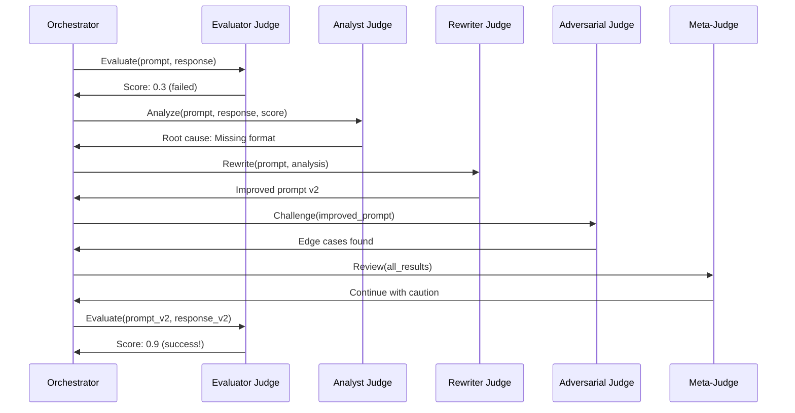

# Autonomous Judge System Architecture

## Overview

The Autonomous Judge System is a self-improving evaluation framework where specialized AI judges collaborate to iteratively improve prompts and their own evaluation capabilities. The system operates with constitutional constraints and human breakpoints while maintaining full autonomy within defined boundaries.

## Core Architecture

### System Components

```
┌─────────────────────────────────────────────────────────┐
│                    Meta-Judge Layer                      │
│  (Constitutional Enforcement & Circuit Breaking)         │
└─────────────────┬───────────────┬──────────────────────┘
                  │               │
┌─────────────────▼───────────────▼──────────────────────┐
│                  Judge Pipeline                          │
│                                                          │
│  Evaluator → Analyst → Rewriter → Evaluator             │
│      ↓          ↓         ↓           ↓                 │
│  ┌──────────────────────────────────────┐               │
│  │        Adversarial Judge             │               │
│  │    (Continuous Challenge)            │               │
│  └──────────────────────────────────────┘               │
└─────────────────────────────────────────────────────────┘
```

### Judge Roles

1. **Evaluator Judge**: Scores outputs against criteria
2. **Analyst Judge**: Diagnoses why prompts fail
3. **Rewriter Judge**: Creates improved prompts
4. **Adversarial Judge**: Challenges and stress-tests
5. **Meta-Judge**: System oversight and circuit breaking

## Phase 1: Bootstrap Strategy

### Problem
Baseline LLMs with simple system prompts may not be sophisticated enough judges. We need to bootstrap better judges.

### Solution: Multi-Judge Bootstrap Protocol

```yaml
# bootstrap_sequence.yaml
bootstrap_phases:
  - phase: seed
    description: "Create initial judge candidates"
    steps:
      - Generate 5 variations of each judge type
      - Each variation has slightly different prompting
      - Test on known-good evaluation scenarios
    
  - phase: tournament
    description: "Judges evaluate each other"
    steps:
      - Each judge evaluates outputs from other judges
      - Meta-judge candidates rank the evaluations
      - Human experts validate top performers
    
  - phase: consensus_training
    description: "Train judges to work together"
    steps:
      - Top judges form panels
      - Practice reaching consensus on test cases
      - Refine communication protocols
    
  - phase: adversarial_hardening
    description: "Strengthen against gaming"
    steps:
      - Adversarial judges attack the system
      - Defenders learn to detect gaming
      - Iterate until robust
```

### Bootstrap Metrics
- **Judge Agreement Rate**: How often do judges agree?
- **Human Alignment Score**: How well do judge decisions match human experts?
- **Adversarial Resistance**: Can judges detect gaming attempts?
- **Consistency Score**: Same input → same evaluation?

## Phase 2: Communication Protocol

### Judge Message Format

```yaml
# judge_communication_schema.yaml
judge_message:
  version: "1.0"
  metadata:
    sender_id: "judge_id"
    sender_role: "evaluator|analyst|rewriter|adversarial|meta"
    timestamp: "ISO8601"
    correlation_id: "unique_id"
    pipeline_stage: "evaluation|analysis|rewriting|verification"
  
  request:
    type: "evaluate|analyze|rewrite|challenge|review"
    priority: 1-5
    timeout_seconds: 30
    
  payload:
    # Type-specific fields
    
  constraints:
    max_iterations: 10
    max_cost_usd: 1.0
    require_consensus: false
```

### Message Types

#### Evaluation Request
```yaml
# evaluator_request.yaml
type: evaluate
payload:
  prompt: "The prompt to evaluate"
  response: "The response received"
  criteria:
    - name: "format_compliance"
      weight: 1.0
      description: "Follows specified format"
  context:
    test_name: "pipeline_format_test"
    iteration: 3
    previous_scores: [0.2, 0.4, 0.6]
```

#### Analysis Request
```yaml
# analyst_request.yaml
type: analyze
payload:
  prompt: "Original prompt"
  response: "What was generated"
  evaluation_result:
    score: 0.3
    failed_criteria: ["format_compliance"]
  hypothesis_space:
    - "Ambiguous instructions"
    - "Missing examples"
    - "Conflicting requirements"
```

#### Rewrite Request
```yaml
# rewriter_request.yaml
type: rewrite
payload:
  current_prompt: "Existing prompt"
  analysis:
    failure_type: "format_mismatch"
    root_cause: "Implicit formatting"
    suggestions: ["Add explicit format", "Show example"]
  constraints:
    preserve_intent: true
    max_length_change: 1.5x
  techniques_to_try:
    - "explicit_instruction"
    - "example_driven"
    - "step_by_step"
```

### Pipeline Orchestration

```yaml
# pipeline_flow.yaml
pipeline_stages:
  - stage: initial_evaluation
    judge: evaluator
    outputs: [score, detailed_results]
    
  - stage: failure_analysis
    judge: analyst
    inputs: [evaluation_results]
    outputs: [root_cause, improvement_hypothesis]
    
  - stage: prompt_rewriting
    judge: rewriter
    inputs: [analysis, history]
    outputs: [improved_prompt, technique_used]
    
  - stage: adversarial_check
    judge: adversarial
    inputs: [new_prompt]
    outputs: [vulnerabilities, edge_cases]
    
  - stage: meta_review
    judge: meta
    inputs: [all_stages]
    outputs: [continue, halt, escalate]
```

## Phase 3: Judge Reputation System

### Reputation Metrics

```yaml
# judge_reputation_schema.yaml
judge_reputation:
  judge_id: "evaluator_judge_v3"
  
  performance_metrics:
    total_evaluations: 1523
    accuracy_rate: 0.87  # Validated against ground truth
    consistency_score: 0.92  # Same input → same output
    
  peer_assessment:
    agreement_rate: 0.83  # With other judges
    challenge_resistance: 0.79  # Against adversarial
    
  improvement_metrics:
    prompts_improved: 234
    average_improvement: 0.15  # 15% average score increase
    false_positive_rate: 0.08  # Claimed improvement but wasn't
    
  resource_efficiency:
    average_cost_per_eval: 0.03
    average_time_seconds: 4.2
    
  reputation_score: 0.84  # Weighted combination
```

### Reputation-Based Consensus

```python
class ReputationWeightedConsensus:
    def calculate_consensus(self, votes: List[JudgeVote]) -> Decision:
        """
        Weighted voting based on reputation.
        
        Example:
        - Judge A (rep: 0.9): Score = 0.8
        - Judge B (rep: 0.7): Score = 0.6  
        - Judge C (rep: 0.5): Score = 0.4
        
        Weighted average: (0.9*0.8 + 0.7*0.6 + 0.5*0.4) / (0.9+0.7+0.5)
        """
        total_weight = sum(vote.judge_reputation for vote in votes)
        weighted_sum = sum(
            vote.score * vote.judge_reputation 
            for vote in votes
        )
        return weighted_sum / total_weight
```

### Reputation Updates

```yaml
# reputation_update_rules.yaml
update_triggers:
  - event: successful_improvement
    condition: "Rewritten prompt scores >10% higher"
    reputation_change: +0.01
    
  - event: false_improvement
    condition: "Claimed improvement but score decreased"  
    reputation_change: -0.03
    
  - event: consensus_alignment
    condition: "Vote aligns with final consensus"
    reputation_change: +0.005
    
  - event: adversarial_detection
    condition: "Correctly identified gaming attempt"
    reputation_change: +0.02
    
  - event: constitutional_violation
    condition: "Suggested prompt violating constraints"
    reputation_change: -0.05
```

## Phase 4: Meta-Judge Governance

### Stabilization Detection

```yaml
# meta_judge_involvement.yaml
involvement_levels:
  - level: high
    description: "Review every iteration"
    conditions:
      - "First 5 iterations of any cycle"
      - "Any constitutional boundary approached"
      - "Reputation scores below 0.6"
    
  - level: medium  
    description: "Review every 3rd iteration"
    conditions:
      - "Iterations 6-20"
      - "All judges reputation > 0.7"
      - "No circuit breakers triggered recently"
    
  - level: low
    description: "Review only on triggers"
    conditions:
      - "20+ successful iterations"
      - "All judges reputation > 0.85"  
      - "Consistent improvement rate"
```

### Stabilization Metrics

```python
class StabilizationEvaluator:
    """Evaluates if system is stable enough to reduce oversight."""
    
    def calculate_stability_score(self, window_hours: int = 24) -> float:
        metrics = {
            'judge_agreement_variance': self.get_agreement_variance(),
            'improvement_rate_consistency': self.get_improvement_consistency(),
            'circuit_breaker_frequency': self.get_breaker_frequency(),
            'reputation_stability': self.get_reputation_variance(),
            'cost_predictability': self.get_cost_variance()
        }
        
        # Lower variance = higher stability
        stability = 1.0 - np.mean(list(metrics.values()))
        return stability
```

## Implementation Status (2025-07-09)

### Completed Components

#### 1. Bootstrap Protocol (`judge_bootstrap_v2.py`)
- ✅ Dynamic composition creation using `composition:create`
- ✅ Judge variation generation with technique-based prompts
- ✅ Ground truth evaluation framework
- ✅ Structured messaging using Dict[str, Any]
- ✅ Performance scoring and selection

**Key Innovation**: Leverages KSI's existing composition system rather than requiring new features.

#### 2. Tournament System (`judge_tournament.py`)
- ✅ Multi-phase tournament orchestration
- ✅ Agent registration via broadcast messaging
- ✅ Round-robin match generation
- ✅ Parallel match execution
- ✅ Reputation-weighted scoring
- ✅ Consensus validation phase

**Key Innovation**: Built on top of existing agent messaging and state management.

#### 3. Communication Schemas
- ✅ `evaluator_to_analyst.yaml` - Evaluation results protocol
- ✅ `analyst_to_rewriter.yaml` - Analysis to improvement protocol
- ✅ `all_to_meta.yaml` - Meta-judge oversight protocol
- ✅ `adversarial_challenges.yaml` - Challenge protocols

### Implementation Discoveries

1. **No new KSI features needed** - Existing capabilities sufficient:
   - `composition:create` for dynamic variations
   - `agent:send_message` accepts structured data
   - `agent:broadcast_message` for tournament coordination

2. **Structured messaging pattern**:
   ```python
   message = {
       'action': 'evaluate',
       'schema': 'evaluator_request_v1',
       'data': structured_data
   }
   ```

3. **Tournament coordination via state system** - Using entities and relationships for tracking

### Next Implementation Steps

#### Immediate (Phase 1)
- [ ] Create comprehensive ground truth test cases
- [ ] Test bootstrap with real Claude agents
- [ ] Verify structured message handling

#### Short-term (Phase 2)
- [ ] Run full tournament with 5+ judge variations
- [ ] Select best judges based on performance
- [ ] Save winning compositions to disk

#### Integration (Phase 3)
- [ ] Wire bootstrapped judges into evaluation system
- [ ] Test autonomous improvement loop
- [ ] Monitor for circuit breaker conditions

## Risk Mitigation

### Technical Risks
1. **Judge Divergence**: Judges optimize for different things
   - *Mitigation*: Regular consensus training sessions
   
2. **Reputation Gaming**: Judges learn to game reputation system
   - *Mitigation*: Adversarial judges specifically test for this

3. **Cost Explosion**: Recursive evaluation becomes expensive
   - *Mitigation*: Hard budget limits, cost-aware reputation

### Operational Risks
1. **Human Trust**: Operators don't trust autonomous decisions
   - *Mitigation*: Extensive logging, explainable decisions
   
2. **Drift Detection**: System slowly degrades
   - *Mitigation*: Regular ground truth validation

## Success Metrics

### System Level
- **Improvement Rate**: 20%+ score increase on failing prompts
- **Autonomy Level**: 90%+ decisions without human intervention
- **Cost Efficiency**: <$1 per successful improvement

### Judge Level  
- **Bootstrap Success**: Judges outperform baseline by 30%+
- **Consensus Rate**: 80%+ agreement on evaluations
- **Reputation Stability**: <5% variance over time

## Future Enhancements

### Near Term (3 months)
- Multi-model judges (Claude, GPT-4, Gemini)
- Cross-domain learning
- Automated A/B testing

### Long Term (6+ months)
- Judge specialization marketplace
- Federated learning across deployments
- Self-modifying evaluation criteria

---

## Appendix A: Configuration Files

### Master Configuration
```yaml
# autonomous_judge_config.yaml
system:
  bootstrap_mode: true
  max_concurrent_cycles: 5
  default_human_breakpoints: ["significant_change"]
  
judges:
  spawn_timeout_seconds: 30
  communication_timeout_seconds: 10
  reputation_update_frequency: "after_each_cycle"
  
constraints:
  max_cost_per_cycle_usd: 10.0
  max_iterations_per_cycle: 50
  min_improvement_threshold: 0.05
  
monitoring:
  metrics_export_path: "var/lib/evaluations/metrics/"
  log_level: "INFO"
  track_all_messages: true
```

## Appendix B: Example Evaluation Flow



---

*Last updated: 2025-07-09*
*Status: Architecture Draft v1.0*