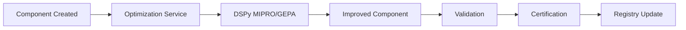

# Component Certification Strategic Roadmap

**Date**: 2025-08-25  
**Version**: 1.0

## Strategic Decisions Made

### 1. Certification Requirements

**Decision**: Certification should be mandatory for component registration but not block access.

**Implementation**:
- Components must attempt certification on registration
- Uncertified components remain accessible with warnings
- Development/testing can use uncertified components
- Production environments should prefer certified components

**Rationale**: Balances quality assurance with development flexibility.

### 2. Warning System for Agent Spawn

**Decision**: Add certification warnings to agent spawn success responses.

**Implementation Requirements**:
- Warnings must be part of the normal success result
- Must not interfere with routing system's error bubbling
- Should follow existing result/error handling patterns

**Example Response Structure**:
```json
{
  "status": "success",
  "agent_id": "test_agent_001",
  "warnings": [
    {
      "type": "certification",
      "message": "Component 'agents/custom_agent' is not certified",
      "severity": "medium"
    }
  ]
}
```

### 3. Component Discovery Enhancement

**Decision**: Add certification status to component discovery responses.

**Implementation**:
```json
{
  "name": "agents/improved_greeting",
  "certification": {
    "status": "certified",
    "certificate_id": "eval_2025_08_25_a814d172",
    "score": 0.95,
    "expires": "2026-08-25"
  }
}
```

## Future Considerations

### 1. Components That Cannot Be Auto-Certified

**Challenge**: Some components require human judgment or external validation.

**Proposed Approach**:
- Create "manual certification" category
- Allow human reviewers to grant certificates
- Track manual vs automated certifications
- Examples: Security-critical components, compliance-related agents

**Timeline**: Q2 2025

### 2. Certification Levels

**Proposed Structure**:
- **Bronze**: Basic structural validation passed
- **Silver**: Automated tests passed (current certification)
- **Gold**: Performance benchmarks + extended testing
- **Platinum**: Manual review + security audit

**Benefits**:
- Gradual quality improvement path
- Clear progression for component authors
- Different requirements for different use cases

**Timeline**: Q3 2025

### 3. Complex Component Certification

**Rule**: Components with extends/mixins only certified when all dependencies certified.

**Implementation**:
```yaml
certification_requirements:
  extends: 
    - base_component: must_be_certified
    - certification_inherit: true
  mixins:
    - all_mixins: must_be_certified
    - certification_cascade: true
```

## Integration with Optimization Service

### DSPy GEPA Addition

**Requirement**: Add DSPy GEPA (Genetic Programming for Evolutionary Architecture) to optimization service.

**Steps**:
1. Update pyproject.toml with latest DSPy version
2. Implement GEPA optimization method in optimization service
3. Create optimization → certification pipeline

**Benefits**:
- Evolutionary improvement of component instructions
- Automated performance optimization
- Data-driven component evolution

### Optimization → Certification Pipeline



## Technical Implementation Priorities

### Phase 1: Foundation (Current)
- ✅ Basic certification system
- ✅ Automated workflow transformer
- ⬜ Fix dependency path issues
- ⬜ Add warnings to agent spawn

### Phase 2: Enhancement (Next Week)
- ⬜ Add certification to discovery
- ⬜ Implement pre-certification validation
- ⬜ Add DSPy GEPA support
- ⬜ Create optimization pipeline

### Phase 3: Advanced Features (Q2 2025)
- ⬜ Certification levels (bronze/silver/gold)
- ⬜ Manual certification process
- ⬜ Security audit integration
- ⬜ Performance benchmarking

## Success Metrics

### Short Term (1 Month)
- 50% of components certified
- 100% structural validation before certification
- Warnings integrated into agent spawn

### Medium Term (3 Months)
- 75% of components certified
- Optimization → certification pipeline operational
- Certification levels implemented

### Long Term (6 Months)
- 90% of active components certified
- Automated recertification on changes
- Full integration with CI/CD pipeline

## Risk Mitigation

### Risk: Certification Blocks Development
**Mitigation**: Allow uncertified components with warnings

### Risk: False Certification Failures
**Mitigation**: Separate structural from quality issues

### Risk: Certification Performance Impact
**Mitigation**: Async certification, caching, batch processing

## Governance

### Certification Standards Committee
- Define certification criteria
- Review manual certification requests
- Update test suites
- Handle appeals

### Update Frequency
- Test suites: Monthly
- Certification criteria: Quarterly
- Manual review: As needed

---

*Document Status: Living Document*  
*Last Updated: 2025-08-25*  
*Next Review: 2025-09-01*