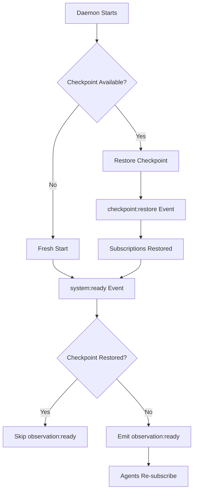

# Observation System Architecture

**Last Updated:** 2025-01-05  
**Status:** Implemented - Ephemeral with Checkpoint Support

## Overview

The KSI observation system enables agents to observe events from other agents, facilitating coordination and monitoring in multi-agent systems. The system implements a **pure infrastructure** approach where observations are ephemeral routing rules that can be checkpointed for system continuity.

## Core Design Principles

### 1. Ephemeral by Default
- Observation subscriptions are in-memory routing rules
- Subscriptions do not persist across daemon restarts
- Agents must re-establish subscriptions when the system starts without checkpoint restoration

### 2. Checkpoint Capability
- Subscriptions can be preserved through the checkpoint/restore mechanism
- When a checkpoint is restored, subscriptions are automatically reconstructed
- Provides true system continuity for critical scenarios

### 3. Event-Driven Architecture
- All observation notifications flow through the event system
- Asynchronous processing prevents blocking event emission
- Circuit breaker pattern protects against failing observers

## Architecture Components

### Observation Manager (`observation_manager.py`)
The core component that manages subscription state and routing:

```python
# In-memory state (ephemeral)
_subscriptions: Dict[str, List[Dict[str, Any]]]  # target_id -> subscriptions
_observers: Dict[str, Set[str]]                  # observer_id -> set of target_ids
_rate_limiters: Dict[str, RateLimiter]          # subscription_id -> rate limiter

# Async processing
_observation_queue: asyncio.Queue  # For non-blocking event processing
_observation_task: asyncio.Task    # Background processor

# Circuit breaker state
_observer_failures: Dict[str, List[datetime]]  # Failure tracking
_observer_circuit_open: Dict[str, datetime]    # Circuit open until
```

### Historical Observations (`historical.py`)
Enables querying past events from the event log:
- `observation:query` - Query historical events by target, patterns, time range
- `observation:replay` - Replay historical events to an observer
- `observation:analyze` - Analyze patterns (frequency, errors, performance)

### Integration Points

#### Event Router Integration
The event router checks for observation subscriptions during event emission:
```python
# In event_system.py
matching_subscriptions = should_observe_event(event, source_agent, data)
if matching_subscriptions:
    await notify_observers_async(subscriptions, "begin", event, data, source_agent)
```

#### Agent Service Integration
Agents can configure observations in their profiles and re-establish them on startup:
```yaml
observation_config:
  subscriptions:
    - target_pattern: "parent"
      events: ["directive:*", "task:assigned"]
    - target_pattern: "children"
      events: ["task:completed", "error:*"]
```

## Lifecycle Management

### System Startup Flow



### Subscription Lifecycle

1. **Creation**: Agent calls `observation:subscribe`
2. **Active**: Events matching patterns are routed to observers
3. **Termination**: Cleaned up when agent terminates or unsubscribes
4. **Restoration**: Re-established on startup or restored from checkpoint

## Event Flow

### Live Observations
1. Source agent emits event
2. Event router checks for matching subscriptions
3. Matching events queued for async processing
4. Observer receives `observe:begin` and `observe:end` events
5. Circuit breaker tracks delivery success/failure

### Historical Observations
1. Agent queries with `observation:query`
2. Event log searched for matching events
3. Results returned with pagination support
4. Optional replay sends events as observations

## Performance Optimizations

### Async Processing Queue
- Observations processed outside event emission hot path
- Batching for efficiency (up to 10 events per batch)
- Queue size limit prevents memory exhaustion

### Circuit Breaker Pattern
- Tracks failures per observer (5 failures = open circuit)
- Circuit opens for 1 minute on repeated failures
- Prevents cascading failures from broken observers

### Rate Limiting
- Per-subscription rate limits
- Configurable max events and time windows
- Prevents observation flooding

## Configuration

### Agent Profile Configuration
```yaml
observation_config:
  subscriptions:
    - target_pattern: "parent"      # Special pattern for originator
      events: ["directive:*"]
      filter:
        exclude: ["debug:*"]
        sampling_rate: 1.0
        rate_limit:
          max_events: 100
          window_seconds: 60.0
```

### Target Patterns
- `parent` - Observe the originator agent
- `children` - Observe all spawned agents
- `{agent_id}` - Specific agent by ID
- `{pattern}*` - Wildcard pattern matching

## API Reference

### Core Events

#### `observation:subscribe`
Create a new observation subscription.
```json
{
  "observer": "agent_1",
  "target": "agent_2",
  "events": ["task:*", "error:*"],
  "filter": {
    "exclude": ["debug:*"],
    "rate_limit": {
      "max_events": 10,
      "window_seconds": 60
    }
  }
}
```

#### `observation:unsubscribe`
Remove observation subscription(s).
```json
{
  "subscription_id": "sub_abc123"
  // OR
  "observer": "agent_1",
  "target": "agent_2"
}
```

#### `observation:list`
List active subscriptions.
```json
{
  "observer": "agent_1",  // optional filter
  "target": "agent_2"     // optional filter
}
```

### Historical Events

#### `observation:query`
Query historical observations from event log.
```json
{
  "target": "agent_2",
  "events": ["task:*"],
  "time_range": {
    "start": "2025-01-05T10:00:00Z",
    "end": "2025-01-05T11:00:00Z"
  },
  "limit": 100,
  "offset": 0
}
```

#### `observation:analyze`
Analyze observation patterns.
```json
{
  "target": "agent_2",
  "analysis_type": "frequency",  // or "errors", "performance"
  "time_range": {...}
}
```

## Checkpoint/Restore Behavior

### What Gets Checkpointed
- Active subscription list with all parameters
- Rate limiter configurations
- Subscription metadata

### What Doesn't Get Checkpointed
- Circuit breaker state (resets on restore)
- In-flight observations in async queue
- Failure history

### Restore Process
1. `checkpoint:restore` event received
2. Subscriptions reconstructed from checkpoint data
3. Rate limiters recreated with saved parameters
4. `observation:restored` event emitted
5. Agents notified not to re-subscribe

## Best Practices

### For Agent Developers

1. **Configure observations in profiles** rather than hardcoding
2. **Handle observation:ready events** to re-establish subscriptions
3. **Use rate limiting** for high-frequency event sources
4. **Implement observation handlers** that won't fail repeatedly

### For System Operators

1. **Monitor circuit breaker logs** for failing observers
2. **Use checkpoint/restore** for planned restarts
3. **Query historical observations** for debugging
4. **Set appropriate rate limits** to prevent observation storms

## Error Handling

### Observer Failures
- Failed deliveries tracked per observer
- Circuit breaker opens after 5 failures in 5 minutes
- Circuit remains open for 1 minute
- Automatic retry when circuit closes

### Queue Overflow
- Async queue has 1000 event limit
- Overflow events are dropped with warning
- Monitor logs for queue full warnings

### Invalid Subscriptions
- Agent existence validated on subscription
- Invalid patterns rejected immediately
- Orphaned subscriptions cleaned on agent termination

## Future Considerations

1. **Distributed Observations** - Cross-daemon observation routing
2. **Subscription Templates** - Reusable observation patterns
3. **Advanced Filtering** - Content-based routing, complex queries
4. **Metrics Integration** - Observation statistics and monitoring

## Conclusion

The observation system provides a clean, performant solution for agent coordination through event observation. Its ephemeral nature with checkpoint support balances simplicity with operational flexibility, while the async processing and circuit breaker patterns ensure system stability under load.